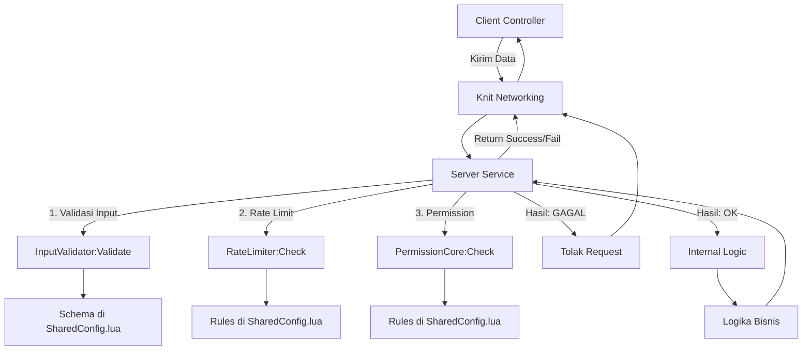

> START OF ./docs/100_ENGINE_GUIDES/102_CORE_MECHANICS.md
>
> **OVHL ENGINE V3.1.0** > **STATUS:** FINAL & AUTHORITATIVE
> **AUDIENCE:** ENGINE ENGINEERS
> **PURPOSE:** Menjelaskan detail teknis "Black Box" engine (Boot Sequence, Data Flow) untuk keperluan debug dan rebuild.

---

# ⚙️ 102_CORE_MECHANICS.MD (Deep Dive)

---

## 1. THE BOOT SEQUENCE (Urutan Nyala)

OVHL V3.1.0 menggunakan urutan booting deterministik, seperti yang didefinisikan dalam `104_ROADMAP_BUILD.md` (Phase 1).

### FASE 1: RUNTIME WAKE UP

File `ServerRuntime.server.lua` (atau `ClientRuntime.client.lua`) berjalan.

1.  **Knit Load:** Memuat `Knit` dari `Packages/`.
2.  **Bootstrap Call:** Memanggil `Bootstrap:Initialize()`.

### FASE 2: SMART DISCOVERY (Bootstrap)

File: `Core/Bootstrap.lua`

1.  **Environment Check:** Memisahkan `Server` dan `Client`.
2.  **Manual Foundation:** `SmartLogger` dimuat secara manual _pertama kali_ (via `require` langsung) agar log tersedia dari detik ke-0.
3.  **Registration:** Mendaftarkan sistem-sistem yang ditemukan ke `SystemRegistry` beserta _dependensi_-nya (yang di-hardcode di dalam tabel `systemDependencies` di `Bootstrap.lua`).

### FASE 3: DEPENDENCY RESOLUTION (SystemRegistry)

File: `Core/SystemRegistry.lua`

1.  **Input:** Daftar sistem tak berurutan dari `Bootstrap`.
2.  **Process:** Melakukan **Topological Sort**. Jika A butuh B, B dijamin akan ada di urutan _sebelum_ A.
3.  **Output:** Array linier (Contoh: `ConfigLoader` -> `SmartLogger` -> `InputValidator`).
4.  **Execution:** `Bootstrap` mengambil array terurut ini dan memanggil `System:Initialize(Logger)` pada setiap sistem, satu per satu.

### FASE 4: KNIT BRIDGE (Kernel)

File: `Core/Kernel.lua`

1.  **Module Scan:** `Kernel` memindai folder `Modules/` di `ServerScriptService` (untuk _Service_) dan `StarterPlayerScripts` (untuk _Controller_).
2.  **Knit Registration:** `Kernel` memanggil `Knit:GetService(ServiceName)` atau `Knit:GetController(ControllerName)`. Ini adalah _panggilan inisialisasi_ yang memicu Knit untuk memuat dan mendaftarkan Service/Controller tersebut.

---

## 2. DATA FLOW & SECURITY PIPELINE

Ini adalah alur kerja standar untuk **Modul Gameplay** yang mengikuti `201_CONTRIBUTING_MODULE.md`.

---

## 3. UI RENDERING PIPELINE (FUSION 0.3 SCOPED)

Ini adalah bagian paling kritikal untuk menghindari memory leak dan error `scopeMissing`.

1.  **Request:** `MinimalController` memanggil `UIEngine:CreateScreen("MyUI", config)`.
2.  **Scope Init:** `UIEngine.lua` secara internal membuat `local scope = Fusion.scoped(Fusion)`. Ini adalah **Hukum #5** dari `101_GENESIS_ARCHITECTURE.md`.
3.  **Component Creation:**
    - Semua komponen (`Frame`, `TextButton`) dibuat menggunakan `scope:New "ClassName" {}`.
    - **PENTING:** Event listener (`[OnEvent "Activated"]`) di-bind menggunakan _closure_ yang aman di dalam _scope_ tersebut.
4.  **Binding:** `UIManager` dapat menggunakan `FindComponent` untuk me-mount _logic_ tambahan ke komponen yang sudah di-render oleh `UIEngine`.
5.  **Cleanup (Otomatis):** Saat `scope` tersebut hancur (misal: UI ditutup atau `scope:destroy()` dipanggil), Fusion secara otomatis membersihkan semua instance dan _event connection_ yang dibuat di dalamnya, mencegah memory leak.

---

> END OF ./docs/100_ENGINE_GUIDES/102_CORE_MECHANICS.md
