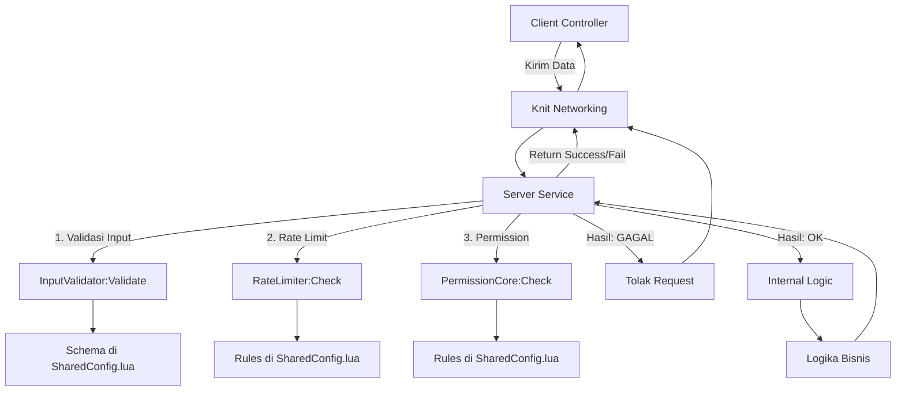

> START OF ./docs/100_ENGINE_GUIDES/102_CORE_MECHANICS.md
>
> **OVHL ENGINE V3.4.0** > **STATUS:** FINAL & AUTHORITATIVE
> **AUDIENCE:** ENGINE ENGINEERS
> **PURPOSE:** Menjelaskan detail teknis "Black Box" engine (Boot Sequence, Data Flow) untuk keperluan debug dan rebuild.

---

# ⚙️ 102_CORE_MECHANICS.MD (Deep Dive)

---

## 1. THE BOOT SEQUENCE (Urutan Nyala V3.4.0 - ADR-004)

OVHL V3.4.0 menggunakan urutan booting deterministik 4-Fase, menghilangkan _race condition_ secara permanen.

| Fase       | Nama Internal | Tindakan Utama (SystemRegistry)                                                               | Aturan Kunci untuk System Anda                                                              |
| :--------- | :------------ | :-------------------------------------------------------------------------------------------- | :------------------------------------------------------------------------------------------ |
| **FASE 1** | `Initialize`  | Memanggil `:Initialize()` pada semua Sistem (Topological Order).                              | HANYA menyimpan logger dan menyiapkan variabel. **DILARANG** panggil `OVHL:GetSystem()`.    |
| **FASE 2** | `Register`    | Mendaftarkan semua _instance_ yang telah di-init ke _gateway_ `OVHL:GetSystem()`.             | Memungkinkan resolusi dependensi yang aman di Fase 3.                                       |
| **FASE 3** | `Start`       | Memanggil `:Start()` pada semua Sistem.                                                       | **WAJIB** panggil `OVHL:GetSystem()` di sini. Melakukan koneksi _event_ dan memulai _loop_. |
| **FASE 4** | `Destroy`     | Dipicu oleh `game:BindToClose()`. Memanggil `:Destroy()` secara **Terbalik** (Reverse Order). | Membersihkan _memory leak_ (`Disconnect()`, hentikan `task.spawn()`).                       |

### FASE 1: RUNTIME WAKE UP

File `ServerRuntime.server.lua` (atau `ClientRuntime.client.lua`) berjalan.

1. **Knit Load:** Memuat `Knit` dari `Packages/`.
2. **Bootstrap Call:** Memanggil `Bootstrap:Initialize()`.

### FASE 2 & 3: ENGINE CORE ORCHESTRATION

File: `Core/SystemRegistry.lua`

1. **System Discovery:** `Bootstrap` memindai `*Manifest.lua` dan menyerahkannya ke `SystemRegistry`.
2. **Topological Sort:** `SystemRegistry` mengurutkan System berdasarkan dependensi.
3. **Fase 1 (`Initialize`):** Semua System dibuat instansinya.
4. **Fase 2 (`Register`):** Semua System terdaftar ke `OVHL`. Ini adalah **titik aman** di mana `DataManager` dapat ditemukan oleh `PlayerManager`.
5. **Fase 3 (`Start`):** `PlayerManager` mengambil `DataManager` (aman), lalu `DataManager` terhubung ke DataStore.

### FASE 4: KNIT BRIDGE (Kernel)

File: `Core/Kernel.lua`

1. **Module Scan:** `Kernel` memindai folder `Modules/`.
2. **Knit Start:** `Knit.Start()` dipanggil. Semua Service/Controller memanggil `KnitInit()` dan `KnitStart()`.
3. **Knit Init:** Service/Controller sekarang dapat memanggil `self.OVHL:GetSystem("Dependency")` karena `OVHL` sudah stabil sejak Fase 2.

---

## 2. DATA FLOW & SECURITY PIPELINE

Ini adalah alur kerja standar untuk **Modul Gameplay** yang mengikuti `201_CONTRIBUTING_MODULE.md`.

[Image of a data flow diagram titled 'OVHL Security Pipeline' showing a Client Controller sending data through Knit Networking to a Server Service, which then passes the data through three security checks (Input Validation, Rate Limiting, Permission Check) before proceeding to Internal Logic or rejecting the request.]

---

## 3. UI RENDERING PIPELINE (FUSION 0.3 SCOPED)

Ini adalah bagian paling kritikal untuk menghindari memory leak dan error `scopeMissing`.

1. **Request:** `MinimalController` memanggil `UIEngine:CreateScreen("MyUI", config)`.
2. **Scope Init:** `UIEngine.lua` secara internal membuat `local scope = Fusion.scoped(Fusion)`. Ini adalah **Hukum #5** dari `101_GENESIS_ARCHITECTURE.md`.
3. **Component Creation:**
   - Semua komponen (`Frame`, `TextButton`) dibuat menggunakan `scope:New "ClassName" {}`.
   - **PENTING:** Event listener (`[OnEvent "Activated"]`) di-bind menggunakan _closure_ yang aman di dalam _scope_ tersebut.
4. **Binding:** `UIManager` dapat menggunakan `FindComponent` untuk me-mount _logic_ tambahan ke komponen yang sudah di-render oleh `UIEngine`.
5. **Cleanup (Otomatis):** Saat `scope` tersebut hancur (misal: UI ditutup atau `scope:destroy()` dipanggil), Fusion secara otomatis membersihkan semua instance dan _event connection_ yang dibuat di dalamnya, mencegah memory leak.

---

> END OF ./docs/100_ENGINE_GUIDES/102_CORE_MECHANICS.md
